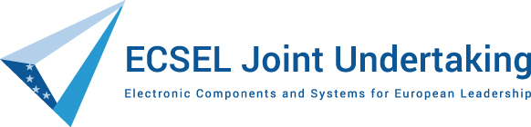
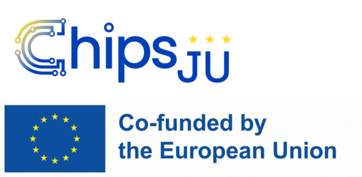

# PhaseRetrieval

Part of the [Phase.jl](https://github.com/JuliaPhase/Phase.jl) ecosystem.

<!-- DOI badge: add after first Zenodo release -->

## Overview

> **Note:** this overview is a temporary README generated by AI (Claude) and has not yet been reviewed by the author.

PhaseRetrieval provides types and algorithms for phase retrieval and wavefront sensing in Julia: forward models of imaging systems (PSF calculation, including vectorial and Shack-Hartmann models), formulation of phase-retrieval problems with phase diversity, and their solution using projection-based methods from AlternatingProjections. It builds on SampledDomains and PhaseBases. The package is under active development (WIP) and is used from other projects.

WIP, used from other projects

## Funding

This work has received funding from the ECSEL Joint Undertaking (JU) under grant agreement No 826589 (MADEin4). The JU receives support from the European Union's Horizon 2020 research and innovation programme and France, Germany, Austria, Italy, Sweden, Netherlands, Belgium, Hungary, Romania and Israel.

This work has received funding from the Chips Joint Undertaking (JU) under grant agreement No 101111948 (14AMI). The JU receives support from the European Union's Horizon Europe research and innovation programme. The project is supported by the Chips Joint Undertaking and its members including the top-up funding by RVO (The Netherlands Enterprise Agency).

